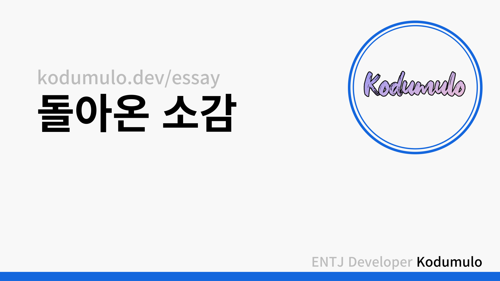

> 2021년 ~ 2022년 잠수 이후 복귀 글

## 이 글을 쓰게 된 이유

2021년~2022년 1년 동안 외부 활동을 일절 하지 않고, 혼자만의 시간을 가지면서 생활했다.

22년 현재 블로그로 다시 돌아온 소감, 그 기간 동안 느낀 점, 그리고 앞으로의 목표를 가지고 이야기해보고자 한다.

## 잠수함 운항 중

2018년 그러니까 고등학교 1학년 시절부터 매년 못해도 대회, 콘퍼런스 각각 4개씩은 무조건 참석했었다.

그렇게 2020년 고등학교 3년까지 매년 못해도 총 8개의 행사를 참여했었고, 여기서 많은 사람을 알게 되었다.

그러다 문뜩 외부 행사에 참여하여 얻을 수 있는 것이 없다고 판단하게 되었다.

새로운 사람을 만나서 친해지는 데 힘을 쓰는 것이 너무 힘들었고, 그 과정에서 잡담하는 부분도 싫었다.

물론 기술적으로 참여해서 여러 새로운 정보나 스택을 알 수 있는 부분도 있었지만..

> 과연 그 부분이 나에게 얼마나 긍정적인 영향을 끼칠까...?

이 생각 한 번으로 정리되었고,

회사를 다니면서 우울증, 건강 등 신체적, 정신적으로 너무 힘들었던 부분도 잠수함을 운행하는데 큰 기여를 했다.

우울증이 온 상태로 스트레스를 너무 받아서 멘탈이 터지면서 계속 혼자 있고 싶게 되었고,

뭐 아무튼 그렇게 여러가지 이유로 잠수함이 출항하게 되었다.

## 혼자만의 시간

외부 활동을 일체 중단하니 ex) 사람 만나기, 컨퍼런스 혹은 대회 참여, 인맥 관리 등등

개인 시간이 많아져서 예전부터 하고 싶었던 공부를 다시 시작하기 시작했다.

kernel부터 시작해서 Python, 네트워크 등 업무에 필요해서 한 부분 말고 기본 지식부터 다시 공부했다.

그리고 나한테 개발이란 무엇인지, 내가 생각하는 개발자 모습보다 내가 어떤 부분이 부족한지 찾아내고,

여러 코딩 스타일, 디자인 패턴, 리팩토링, 알고리즘 등 기본 요소들도 틈틈이 찾아봤다.

이것도 중요한 부분 중의 하나인데, 개발 말고 보안 쪽도 계속 공부했다.(이건 나중에 다른 글로..)

또 멈췄던 운동을 다시 시작했다.

91kg을 찍고 다이어트를 시작하면서 운동을 병행했고, 운동하면서 우울증이 조금씩 괜찮아졌다.

러닝, 헬스, 야구, 농구 등 예전에 했다가 멈췄던 운동을 다시 하고, 최근에는 국궁장에 가서 활도 다시 쏘고 왔다.

## 이직

내가 2020년까지 2년 동안 몸바쳐서 일한 회사를 퇴사하게 되었다.

퇴사하고 4주간 시간이 있었는데, 2주는 병원, 집이 반복하며 치료받았고, 나머지 기간은 집에서 쉬었다.

사실 군대 문제랑 관련되어 있어서 이직하기도 했는데, 내가 존경하는 분 따라온 것도 조금 크다.

이직 얘기는 나중에 다른 글에 따로 포스팅하려고 한다.

## 돌아온 소감

건강 악화, 우울증, 푸짐한 살 힘든 부분이 많았지만, 조금씩 이겨내고 다시 돌아오게 되어서 너무 좋다.

복귀하면서 든 생각은 블로그를 기술적으로 운영하고 싶다는 생각이 크게 들었고, 그렇게 운영할 예정이다.

다시 새로운 개발자와 만나서 얘기하고 토론하면서 서로 의견을 도출하고 막 하는 게 지금 당장은 힘들겠지만,

지금 회사 개발자들과 얘기하는 거 보니까 당장 시작해도 된다.

## 앞으로의 계획

지금 회사에서 주니어 개발자들과 스터디를 만들어서 진행하고 있는데, 내 생각보다 빠른 속도로 진행되고 있다.

그래서 지금 당장은 회사에 있는 주니어 개발자들과 같이 시니어 개발자로 성장하는 게 지금의 목표다.

주변과 비교해보면 나는 프로젝트 기획부터 개발, 유지보수까지 참여했고, 서버 구성, 기초 지식 등등

많은 걸 알고 있어서 시니어 개발자라고 하는 사람을 몇몇 봤지만, 아직 나는 확실하게 주니어 개발자다.

지금 당장 목표는 다 같이 시니어 개발자로 성장해서, 회사에 정당한 요구를 할 수 있는 실력을 갖추는 것이고,

추후에 목표는 항상 말하듯이 연구소를 설립해서 한국에 오픈 소스 커뮤니티를 활성화하는 것이 목표다.

이것도 나중에 블로그로 포스팅할 예정이다.

## 결론

짧으면 짧고, 길면 긴 1년간의 휴식을 마치고, 다시 시작하는 마음으로 블로그를 시작하게 돼서 너무 좋다.

이전에 썼던 볼로 그에 글이 160개 정도 되는데, 다 날리고 시작하니까 섭섭하기도 하고, 시원하기도 하고..

뭐 아무튼 앞으로는 꾸준히 블로그에 글 쓰고, 공부하고, 다시 활발하게 활동할 예정이다.

힘들 때 옆에서 도와준 사람들한테 항상 고마웠고, 나중에 다시 다 보답할 예정이다.

---

글 쓴 걸 보니까 정말 내 맘대로 너무 막 쓴 것 같은 느낌이 든다.

아쉬운 대로 이번 글은 이렇게 마치는 것으로 하고, 앞으로 내가 가려는 길에는 좋은 일만 가득했으면 좋겠다.

**끝**
